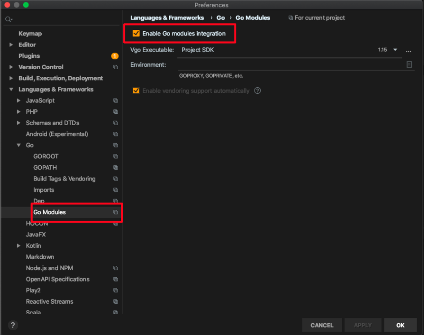

# 環境構築

## 前提条件

- go version: 1.15.0
- moduleを使用する

## goenv

- バージョン管理ツール`goenv`をインストールする
- [github](https://github.com/syndbg/goenv)を参考に以下に手順を記載
- golangをそのままインストールしても構わない
  - macの場合は`brew switch go N.N.N`で切り替えられるらしい => [参考](https://qiita.com/MahoTakara/items/5095ac721aa054cf1cf8)

### git cloneをする
```bash
$ git clone https://github.com/syndbg/goenv.git ~/.goenv
```

### 環境変数を設定する

- zshの場合は`~/.bash_profile`ではなく`~/.zshenv`に書き込み

```bash
$ echo 'export GOPATH="$HOME/.go"' >> ~/.bash_profile
$ echo 'export GOENV_ROOT="$HOME/.goenv"' >> ~/.bash_profile
$ echo 'export PATH="$GOENV_ROOT/bin:$PATH"' >> ~/.bash_profile
```

### terminal起動時にgoenvの初期実行をするように設定

- zshの場合は`~/.bash_profile`ではなく`~/.zshenv` or `~/.zshrc`に書き込み

```bash
$ echo 'eval "$(goenv init -)"' >> ~/.bash_profile
```

### シェルを再起動し、goのバスを確認

```bash
$ exec $SHELL

$ which go
$HOME/.goenv/shims/go # goenvのパスが表示されていればインストール成功
```

### install

- バージョン`1.15.0`のgolangをインストールし、global versionを指定する

```bash
$ goenv install 1.15.0
$ goenv global 1.15.0

$ go version
go version go1.15 darwin/amd64  # バージョンが変わっていることを確認
```

## IntelliJ

### MarketPlaceから以下のプラグインをダウンロードする

- Go
- File Watchers

### GOROOTを設定する

- `Preferences > Languages & Frameworks > Go > GOROOT` を開き、GOROOTを設定する
- GOPATHは設定しない。moduleを使うため


### moduleを使うため、IntelliJで有効にする

- `Preferences > Languages & Frameworks > Go > Go Modules`を開いて設定する



### 保存時にformatを実行するように設定する

- `Preferences > Tools > File Watchers` を開き、左下の「+」をクリックして、「go fmt」を追加。
  - 保存時に`go fmt`が実行される
  


